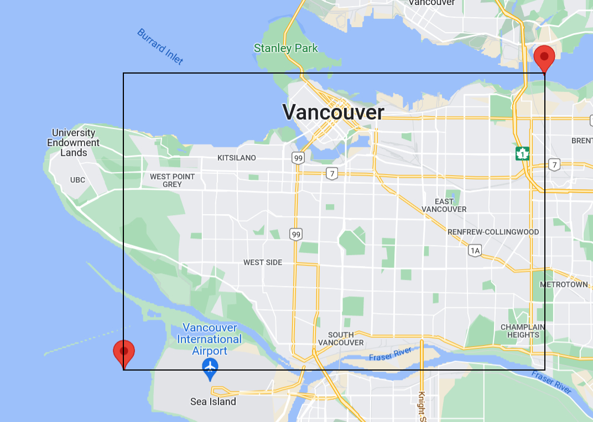

# Java-Mongo Project

This is a personal project I worked on to review and showcase my backend and database skills. For this project I used the 'Street Trees' data from City of Vancouver [Open Data](https://opendata.vancouver.ca/pages/home/) that has

> "a listing of public trees on boulevards in the City of Vancouver and provides data on tree coordinates, species and other related characteristics."

 

I inputted the tree data in a mongoDB and then applied the ETL (Extract, Transform, Load) process to by moving up the sub-document with the important fields as primary keys and generated a `friendly_names` key using the **genus** and **common names** to combine the large diversity of trees into a simpler and more usable naming scheme. This was done by, for example, merging all species of spruce (NORWAY SPRUCE, SITKA SPRUCE, SPRUCE SPECIES, etc.) and making the _friendly name_ be "SPRUCE".

Afterwards, utilizing the updated data, the user is asked for dimensions with which to overlay a `n x m` grid over the City of Vancouver and then each section is analyzed. The current code groups the trees by their friendly name, but any mongo query can be applied to each section.

 

This is the box created from the coordinates of the westernmost, easternmost, northernmost, and southernmost trees in the collection. Afterwards the user's grid is created within this region and the query applied to each section.